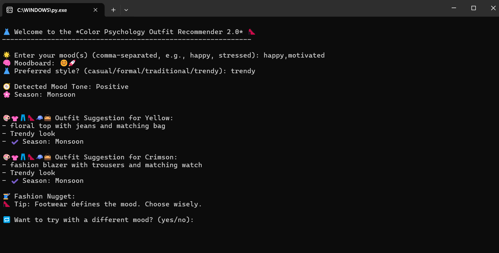

# 🎨 Color Psychology Outfit Recommender

A smart outfit recommendation system that uses your current mood and color psychology to generate full outfit suggestions — from top to shoes, including modern styles and seasonal relevance.

This project includes:
- ✅ A simple *Console-based version* (CLI)
- ✅ A complete *GUI version using Tkinter* with all internship-required features and extra enhancements
- 
## 🧾 Project Overview

This app uses psychological color principles to:
- Analyze your "mood"
- Suggest "matching colors"
- Recommend a "complete outfit" with:
  - Top
  - Bottom
  - Shoes
  - Bag
  - Accessory
  - Add-on (scarf, watch, sunglasses, etc.)
- Adapt to your "style preference" and current "season"

## 💡 Features

- 🔄 Multi-mood input (you can enter 2–3 moods at once)
- 🎨 Multi-color mapping per mood (not just one-to-one)
- 📖 Color psychology explanation (e.g., “Blue calms anger”)
- 👗 Full outfit combinations with:
  - Traditional
  - Trendy
  - Stylish
  - Formal
  - Casual
- 🧥 Includes modern clothing like:
  - Frocks
  - Maxis
  - One-piece
  - Strapless tops
  - Mini skirts
- 🌤 Season-aware outfit generation
- 🖥 GUI built with *Tkinter* (and CLI version for terminal)

## 📁 Folder Structure

Color-Psychology-Outfit-Recommender/
├── gui\_version\_final.py         # GUI version with full features
├── console\_version.py           # Basic CLI version
├── README.md                    # This file
└── screenshots/                 #output images added
|__License/                       #used the MIT license

## 🧠 Color Psychology Examples

| Mood        | Color(s)              | Why? |
|-------------|-----------------------|------|
| Angry       | Blue, White           | Blue calms; white resets emotional state |
| Stressed    | Green, Peach          | Green soothes; peach reduces tension |
| Happy       | Yellow, Pink          | Yellow energizes; pink softens joy |
| Confident   | Emerald Green, Red    | Green empowers; red boosts boldness |

  
## 📸 Screenshots

### 🟡 CLI Version Output

### 🟢 GUI Version Output

## 🛠 Technologies Used

* Python
* Tkinter (for GUI)
* Random (for mixing combinations)
* Dictionaries, functions, conditionals, loops

## 🧪 Versions Included

### 🔹 console_version.py

Basic version you run in terminal (CLI).

bash
python console_version.py

### 🔸 gui_version.py

Advanced version with full features and interface.

bash
python gui_version_final.py

✅ You can run both locally using Python 3.7+

## 🔖 Tags / Topics

python · tkinter · gui · fashion · mood-recommender · internship · color-psychology  .trending .stylish

## 🏁 Author

Made with ❤ by *Teja Hussain*
Part of Python Internship Week 3 Project
